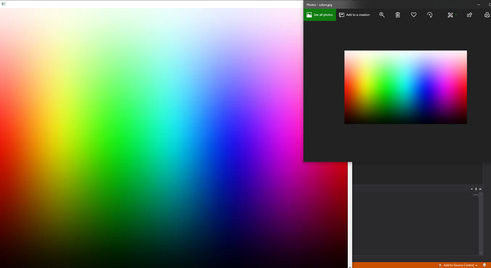
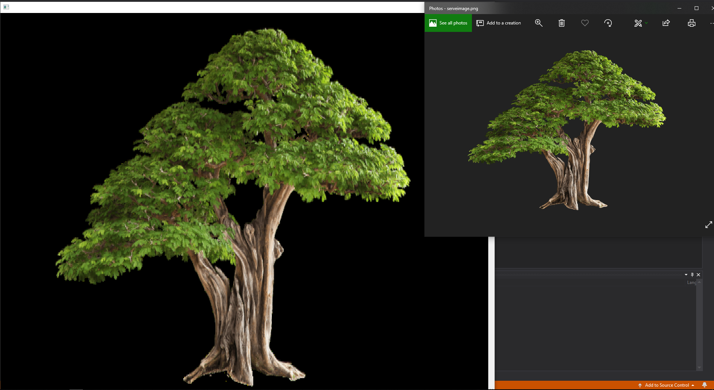
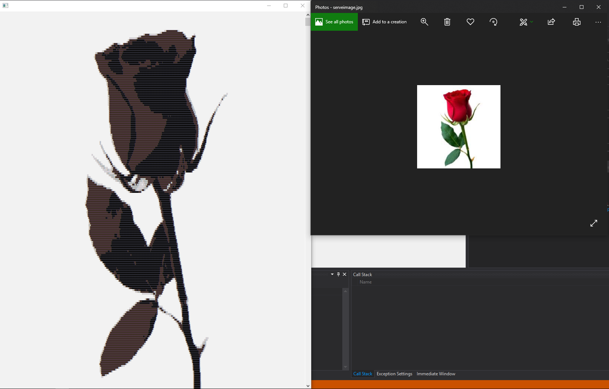

# MediaConsole
Convert pictures and videos to text and displays them in the console.\
Change the font size & console size(videos) for better results.\
Download here: https://github.com/GHenkje/MediaConsole/releases

Usage: ```MediaConsole.exe {path to image/video} Colors:[on|off] Background:[dark|white] [Pixels]```\
Example colors: ```MediaConsole.exe "C:\picture 2.jpg" on```\
Example black/white: ```MediaConsole.exe "C:\picture 2.mp4" off white "#$* "```\
Background and pixels doesn't work with colors enabled.\
The default pixels are: "██▓▓▒░  "

Example video (click for orginal):\
[](https://www.youtube.com/watch?v=vq2jYFZVMDA)

Black/White video (click for orginal):\
[](https://www.youtube.com/watch?v=w3jLJU7DT5E)

Example pictures:\



Black/White picture:\



